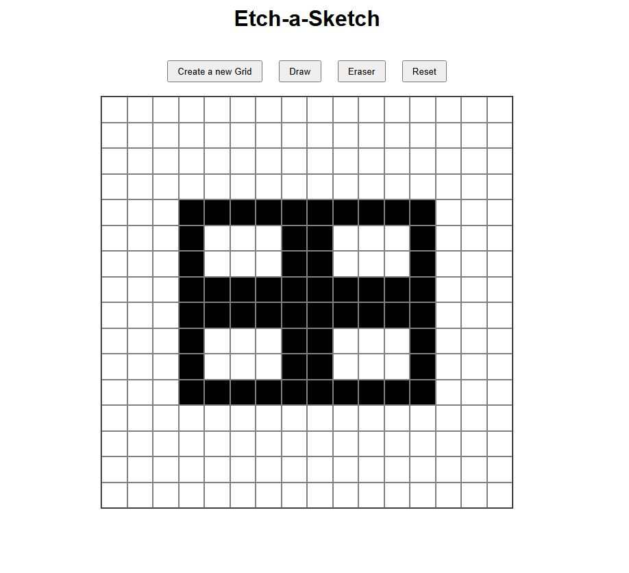

# Etch-a-Sketch

A small and fun simple project made with HTML, CSS, and Javascript to create drawings.

### Overview

#### Features:

- Draw and Erase Button
- Create a new grid size by inputting a number
- Clear the entire grid

#### Tools:

- Visual Studio Code
- HTML
- CSS
- Javascript
- Git
